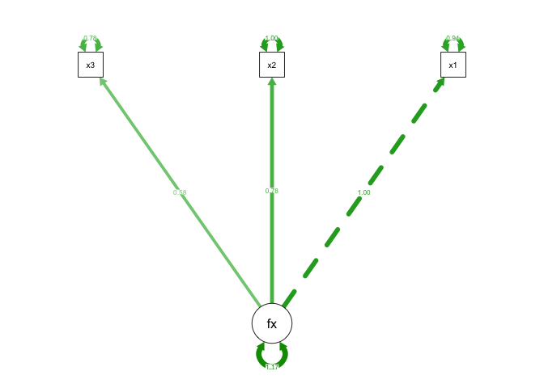
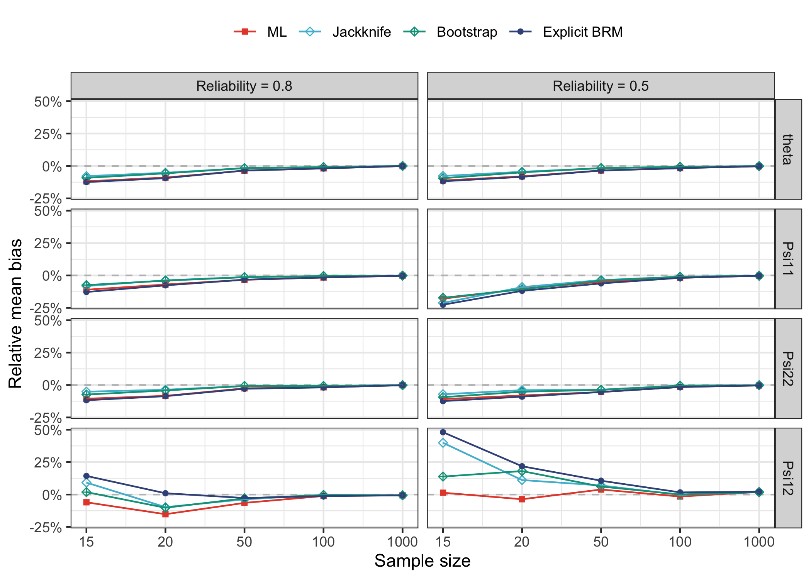

# Empirical bias reducing methods for Structural Equation Models


Last modified: 2024-05-03

## Normal CFA toy example

``` r
# Simulate data
mod <- "fx =~ 1*x1 + 0.8*x2 + 0.6*x3"
n   <- 200
dat <- simulateData(model = mod, sample.nobs = n)
fit <- cfa(model = "fx =~ x1 + x2 + x3", data = dat)
semPaths(fit, "est", rotation = 3)
```



Average bias across `B=1000` simulations (sample size n = 200):

    # A tibble: 6 × 5
      par         ml     ebrm      jack     boot
      <chr>    <dbl>    <dbl>     <dbl>    <dbl>
    1 fx=~x2  0.0274  0.00740  0.00664   0.0114 
    2 fx=~x3  0.0133  0.00443  0.00411   0.0168 
    3 x1~~x1 -0.0286  0.00794  0.0144    0.0308 
    4 x2~~x2 -0.0382 -0.0218  -0.0163   -0.0189 
    5 x3~~x3 -0.0134 -0.00554 -0.000257 -0.00865
    6 fx~~fx  0.0181 -0.0185  -0.0150   -0.0255 

## Growth curve models

### Convergence failures and timings

| rel |    n | fail_ml | fail_jack | fail_boot | fail_ebrm | time_jack | time_boot | time_ebrm |
|:----|-----:|:--------|:----------|:----------|:----------|:----------|:----------|:----------|
| 0.8 |   15 |         |           | 80.74%    | 0.55%     | 1s        | 25s       | 1s        |
| 0.8 |   20 |         |           | 4.62%     | 0.10%     | 2s        | 52s       | 1s        |
| 0.8 |   50 |         |           |           |           | 5s        | 52s       | 1s        |
| 0.8 |  100 |         |           |           |           | 10s       | 52s       | 1s        |
| 0.8 | 1000 |         |           |           |           | 1m 43s    | 52s       | 1s        |
| 0.5 |   15 |         |           | 80.80%    |           | 1s        | 22s       | 1s        |
| 0.5 |   20 |         |           | 5.47%     |           | 1s        | 43s       | 1s        |
| 0.5 |   50 |         |           |           |           | 4s        | 43s       | 1s        |
| 0.5 |  100 |         |           |           |           | 8s        | 43s       | 1s        |
| 0.5 | 1000 |         |           |           |           | 1m 26s    | 43s       | 1s        |

### Relative median bias plot



## Two factor SEM

TBC
