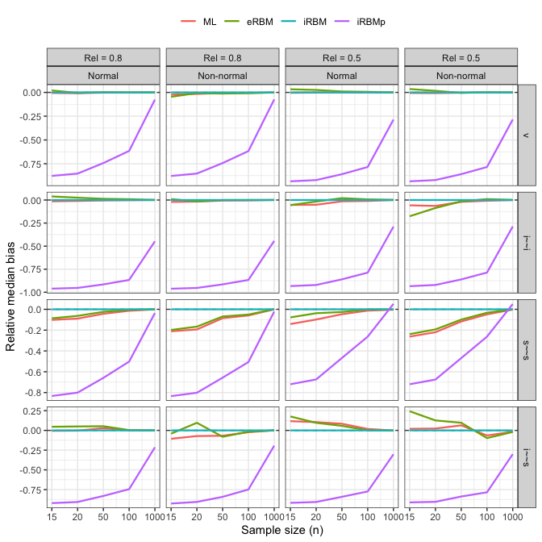

<!-- README.md is generated from README.Rmd. Please edit that file -->

# Empirical bias reducing methods for Structural Equation Models

<!-- badges: start -->
<!-- badges: end -->

Last modified: 2024-10-24

## Toy example: Two factor SEM

Consider the following two factor SEM.

``` r
n <- 1000
dat <- simulateData(
  model = "
    eta1 =~ 1*y1 + 0.8*y2 + 0.6*y3
    eta2 =~ 1*y4 + 0.8*y5 + 0.6*y6
    eta2 ~ 0.3*eta1
  ",
  sample.nobs = n
)
head(dat)
#>           y1          y2          y3         y4          y5          y6
#> 1  0.0304270 -0.04148969 -0.09798811 -0.6380698 -0.75953116  0.06242705
#> 2  0.4146308  4.90231941 -0.16294719  2.3138655  0.84951786  0.86716207
#> 3  0.4930536  0.10865682  3.28843760  0.3894571 -0.68242244  0.67011572
#> 4  3.6620010  1.35717864 -1.21041401 -0.5658309 -0.02357428 -1.27805735
#> 5  3.5672609  2.77039086 -0.50505446 -0.5309798  1.02216691  0.67309419
#> 6 -0.2621683 -0.79783303  0.35043829 -1.0066938 -1.33108271 -0.60076119
```

<!-- -->

Experiment: For each sample size `n` in `c(15, 20, 50, 100, 1000)`, we
simulate `B = 1000` datasets and estimate the model parameters in four
ways.

1.  Maximum likelihood
2.  Explicit RBM
3.  Implicit RBM
4.  Implicit RBM with plugin penalty

Tables and graph below show results (mean bias).

    #> # A tibble: 15 × 10
    #>    n     type   bias_ML bias_eRBM bias_iRBM bias_iRBMp  mse_ML mse_eRBM mse_iRBM
    #>    <fct> <chr>    <dbl>     <dbl>     <dbl>      <dbl>   <dbl>    <dbl>    <dbl>
    #>  1 15    Load…  1.89    -9.31      0.219      0.212    3.57e+0  8.67e+1  4.78e-2
    #>  2 15    Regr…  0.718   -0.165    -0.201     -0.198    5.15e-1  2.72e-2  4.03e-2
    #>  3 15    Vari… -0.708    0.908    -0.178     -0.183    5.01e-1  8.24e-1  3.16e-2
    #>  4 20    Load…  1.65    -3.28      0.206      0.203    2.73e+0  1.08e+1  4.26e-2
    #>  5 20    Regr…  0.390   -3.45     -0.178     -0.179    1.52e-1  1.19e+1  3.16e-2
    #>  6 20    Vari… -0.517   -0.156    -0.151     -0.153    2.67e-1  2.44e-2  2.29e-2
    #>  7 50    Load…  0.220   -0.659     0.0850     0.0799   4.85e-2  4.34e-1  7.22e-3
    #>  8 50    Regr…  0.0536  -0.558    -0.0692    -0.0681   2.87e-3  3.12e-1  4.79e-3
    #>  9 50    Vari… -0.0924   0.144    -0.0532    -0.0554   8.53e-3  2.08e-2  2.83e-3
    #> 10 100   Load…  0.0349   0.0139    0.0433     0.0423   1.22e-3  1.94e-4  1.87e-3
    #> 11 100   Regr…  0.0109  -0.0419   -0.0111    -0.0120   1.20e-4  1.76e-3  1.22e-4
    #> 12 100   Vari… -0.0290  -0.0281   -0.0228    -0.0226   8.42e-4  7.91e-4  5.20e-4
    #> 13 1000  Load…  0.00128 -0.000779  0.00148    0.00148  1.64e-6  6.07e-7  2.19e-6
    #> 14 1000  Regr…  0.00160  0.000855  0.00273    0.00273  2.57e-6  7.32e-7  7.46e-6
    #> 15 1000  Vari… -0.00162 -0.000286 -0.000332  -0.000337 2.63e-6  8.20e-8  1.10e-7
    #> # ℹ 1 more variable: mse_iRBMp <dbl>

<!-- -->

# Growth model a (D&R 2022)

<!-- -->

# Two factor SEM b (D&R 2022)

<!-- -->
