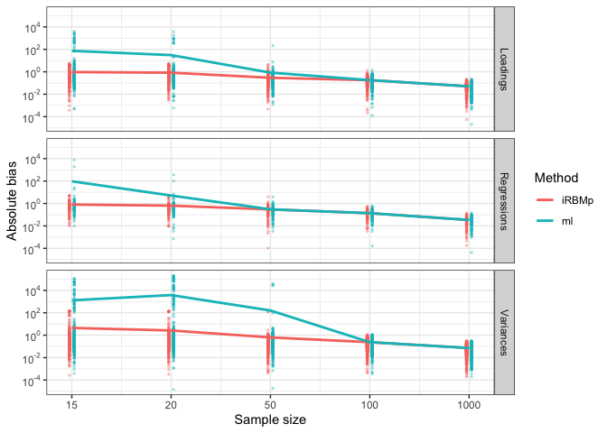

<!-- README.md is generated from README.Rmd. Please edit that file -->

# Empirical bias reducing methods for Structural Equation Models

<!-- badges: start -->
<!-- badges: end -->

Last modified: 2024-08-21

## Two factor SEM toy example

Consider the following two factor SEM.

``` r
n <- 1000
dat <- simulateData(
  model = "
    eta1 =~ 1*y1 + 0.8*y2 + 0.6*y3
    eta2 =~ 1*y4 + 0.8*y5 + 0.6*y6
    eta2 ~ 0.3*eta1
  ",
  sample.nobs = n
)
head(dat)
#>           y1          y2         y3          y4         y5           y6
#> 1 -0.1987795  1.47569521  0.3345119 -0.09372872  0.3556238  0.335905798
#> 2  0.7488490  1.66811067 -1.4445715 -0.52152669  1.4140433  1.224748671
#> 3  0.6114716  1.01155380  0.3142461 -0.09042748 -0.9637810 -0.671176232
#> 4  0.2580086  0.29322528 -1.1469406 -1.27516000 -1.3781009 -0.004485155
#> 5 -2.4213952 -0.08839775  0.5260221  0.88702457 -0.8357927  1.680179704
#> 6  0.1014696 -1.45620112 -0.1933923  1.25690247  0.6028781  0.773355780
```

<!-- -->

Experiment: For each sample size `n` in `c(15, 20, 50, 100, 1000)`, we
simulate `B = 100` datasets and estimate the model parameters in two
ways. The first is maximum likelihood using `{lavaan}`. The second is
the implicit RBM with a penalty term. We then analyse the bias produced
by both methods.

``` r
tab_mab
#> # A tibble: 5 × 4
#>   n            ml  iRBMp   nok
#>   <fct>     <dbl>  <dbl> <dbl>
#> 1 15     826.     3.10     100
#> 2 20    2336.     1.93     100
#> 3 50      98.3    0.504    100
#> 4 100      0.213  0.213    100
#> 5 1000     0.0626 0.0624   100
```

``` r
tab_mab_by_type
#> # A tibble: 15 × 5
#>    n     type               ml  iRBMp   nok
#>    <fct> <chr>           <dbl>  <dbl> <dbl>
#>  1 15    Loadings      73.9    0.947    100
#>  2 15    Regressions   95.7    0.806    100
#>  3 15    Variances   1293.     4.47     100
#>  4 20    Loadings      30.7    0.830    100
#>  5 20    Regressions    5.13   0.644    100
#>  6 20    Variances   3779.     2.65     100
#>  7 50    Loadings       0.842  0.293    100
#>  8 50    Regressions    0.302  0.297    100
#>  9 50    Variances    159.     0.635    100
#> 10 100   Loadings       0.182  0.179    100
#> 11 100   Regressions    0.137  0.138    100
#> 12 100   Variances      0.239  0.239    100
#> 13 1000  Loadings       0.0502 0.0500   100
#> 14 1000  Regressions    0.0340 0.0340   100
#> 15 1000  Variances      0.0723 0.0721   100
```

``` r
p_bias
```

<!-- -->
