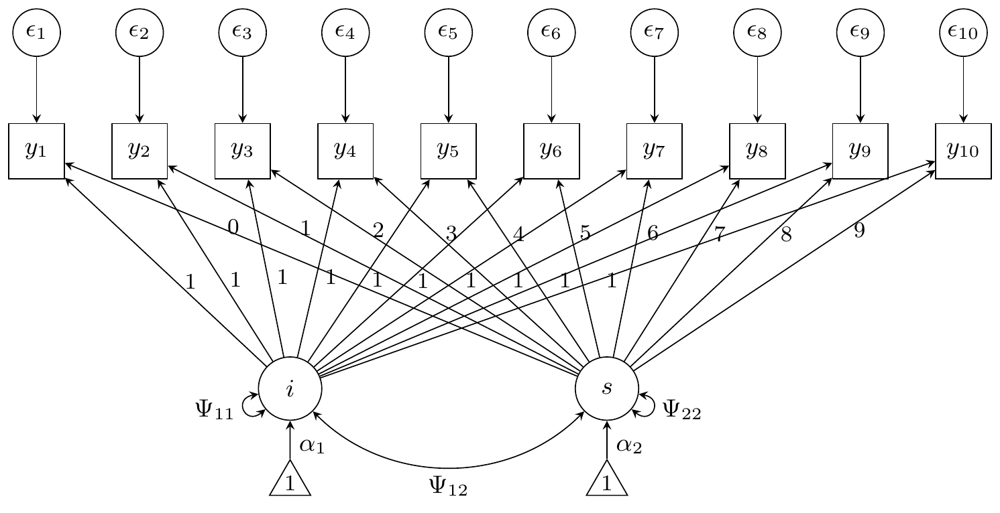
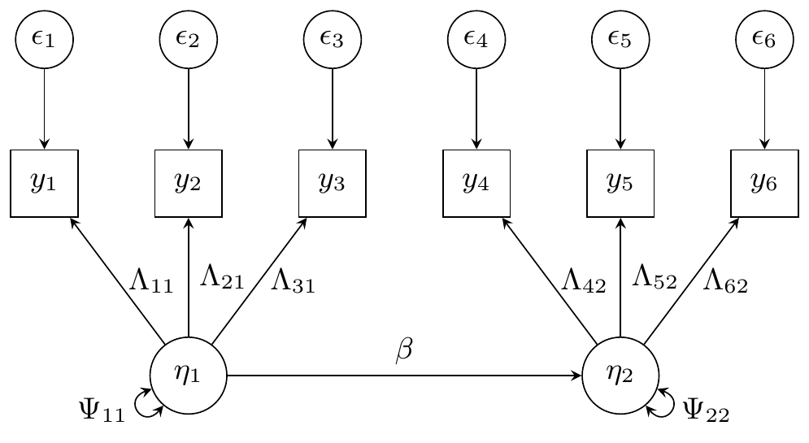

# The basics

## Structural equation models

Let $y_{i} \in {\mathbb{R}}^{p}$, $i = 1,\ldots,n$ be independent
multivariate data observations. A general form for structural equation
models is the following:
$$y_{i} = \nu + \Lambda\eta_{i} + \epsilon_{i},$$ {#eq-measurement}
where the errors $\epsilon_{i} \sim N(0,\Theta)$ are assumed to be
normally distributed, and the latent factors $\eta_{i}$ are related to
each other through the structural part of the model:
$$\eta_{i} = \alpha + B\eta_{i} + \zeta_{i},$$ {#eq-structural} where
$\zeta_{i} \sim N(0,\Psi)$ are the structural disturbances, and $B$ is a
matrix of regression coefficients with 0 on the diagonals. The
structural model can be rewritten as
$\eta_{i} = (I - B)^{- 1}\alpha + (I - B)^{- 1}\zeta_{i}$. Plugging this
into @eq-measurement, we get the reduced form of the model, where each
$y_{i} \sim N_{p}(\mu,\Sigma)$, with $$\begin{aligned}
\mu & {= \mu(\theta) = \nu + \Lambda(I - B)^{- 1}\alpha} \\
\Sigma & {= \Sigma(\theta) = \Lambda(I - B)^{- 1}\Psi(I - B)^{- \top}\Lambda^{\top} + \Theta.}
\end{aligned}$$ We have denoted by $\theta \in {\mathbb{R}}^{m}$ the
collection of all free parameters (intercepts, loadings, regression
coefficients, and variances) in the model. Evidently, the likelihood of
the model is given by the multivariate normal density:
$$\ell(\theta) = - \frac{np}{2}\log(2\pi) - \frac{n}{2}\log|\Sigma| - \frac{1}{2}\sum\limits_{i = 1}^{n}\left( y_{i} - \mu \right)^{\top}\Sigma^{- 1}\left( y_{i} - \mu \right).$$

The gradient of the log-likelihood function with respect to a component
of $\theta$ appearing in the mean vector $\mu$ is given by
$$\begin{aligned}
\frac{\partial\ell}{\partial\theta_{\mu}} & {= \frac{\partial\ell}{\partial\mu}\frac{\partial\mu}{\partial\theta_{\mu}}} \\
 & {= \sum\limits_{i = 1}^{n}\left( y_{i} - \mu \right)^{\top}\Sigma^{- 1} \cdot \frac{\partial\mu}{\partial\theta_{\mu}}} \\
 & {= n\left( \bar{y} - \mu \right)^{\top}\Sigma^{- 1} \cdot \frac{\partial\mu}{\partial\theta_{\mu}}.}
\end{aligned}$$ The gradient of the log-likelihood function with respect
to a component of $\theta$ appearing in $\Sigma$ is given by
$$\begin{aligned}
\frac{\partial\ell}{\partial\theta_{\sigma}} & {= \left\langle \frac{\partial\ell}{\partial\Sigma},\frac{\partial\Sigma}{\partial\theta_{\sigma}} \right\rangle} \\
 & {= \left\langle - \frac{n}{2}\Sigma^{- 1} + \frac{n}{2}\Sigma^{- 1}S\Sigma^{- 1},\frac{\partial\Sigma}{\partial\theta_{\sigma}} \right\rangle} \\
 & {= \left\langle \frac{n}{2}E,\frac{\partial\Sigma}{\partial\theta_{\sigma}} \right\rangle,}
\end{aligned}.$$ where $S$ is the (biased) sample covariance matrix, and
$E = \Sigma^{- 1}(S - \Sigma)\Sigma^{- 1}$.

## Growth curve model

For the growth curve model, we have a latent intercept $i$ and slope $s$
(so $q = 2$). There are five parameters in the latent component: Two
intercepts $\alpha_{1}$ and $\alpha_{2}$, and the three unique variances
and covariances $\Psi_{11}$, $\Psi_{22}$, and $\Psi_{12}$. The loadings
for the “intercept” latent variable are all fixed to 1, whereas the
loadings for the “slope” latent variable increment from 0 to 9. Thus,
$\Lambda$ is some fixed $10 \times 2$ matrix. Furthermore, the observed
variables $y_{j}$, $j = 1,\ldots,p$ share a common residual error
variance $v$. In total, there are six parameters to be estimated in the
model (in this order):
$\theta = \left( \Psi_{11},\alpha_{1},\Psi_{22},\alpha_{2},\Psi_{12},v \right)$.



|                   | Reliability = 0.8 | Reliability = 0.5 |
|-------------------|-------------------|-------------------|
|  $\alpha_{1}$α1​   | 0                 | 0                 |
|  $\alpha_{2}$α2​   | 0                 | 0                 |
|  $\Psi_{1,1}$Ψ1,1​ | 550               | 275               |
|  $\Psi_{2,2}$Ψ2,2​ | 100               | 50                |
|  $\Psi_{1,2}$Ψ1,2​ | 40                | 20                |
|  $v$v             | 500               | 1300              |

For the growth curve model, the gradients are simplified somewhat:

- $\frac{\partial\ell(\theta)}{\partial\alpha} = n\Lambda^{\top}\Sigma^{- 1}\left( \bar{y} - \mu \right)$
- $\frac{\partial\ell}{\partial\Psi_{ij}} = \frac{n}{2}\operatorname{tr}\left\{ \Lambda^{\top}E\Lambda\frac{\partial\Psi}{\partial\Psi_{ij}} \right\}$
- $\frac{\partial\ell}{\partial v} = \frac{n}{2}\operatorname{tr}(E)$

The implementation in R code is also straightforward (see
R/40-manual_growth.R). Compare the behaviour of the eBR and iBR methods
using lavaan’s internals (via
[`fit_sem()`](https://haziqj.ml/brlavaan/reference/fit_sem.md)) and
using manual functions (via
[`fit_growth()`](https://haziqj.ml/brlavaan/reference/fit_growth.md)).

``` r
library(tictoc)
set.seed(26)
dat <- gen_data_growth(n = 15, rel = 0.5, dist = "Normal", scale = 1 / 10)
mod <- txt_mod_growth(0.5)
tru <- truth(dat)

tic.clearlog()
fit <- list()

tic("ML: lavaan")
fit$lav <- growth(mod, dat, start = tru)
toc(log = TRUE)
#> ML: lavaan: 0.157 sec elapsed

tic("ML: brlavaan")
fit$ML <- fit_sem(mod, dat, "none", lavfun = "growth", start = tru)
toc(log = TRUE)
#> ML: brlavaan: 0.026 sec elapsed
tic("eBR: brlavaan")
fit$eBR <- fit_sem(mod, dat, "explicit", lavfun = "growth", start = tru)
toc(log = TRUE)
#> eBR: brlavaan: 0.332 sec elapsed
tic("iBR: brlavaan")
fit$iBR <- fit_sem(mod, dat, "implicit", lavfun = "growth", start = tru)
toc(log = TRUE)
#> iBR: brlavaan: 1.22 sec elapsed

tic("ML: manual")
fit$MLman <- fit_growth(mod, dat, "none", start = tru[1:6])
toc(log = TRUE)
#> ML: manual: 0.013 sec elapsed
tic("eBR: manual")
fit$eBRman <- fit_growth(mod, dat, "explicit", start = tru[1:6])
toc(log = TRUE)
#> eBR: manual: 0.392 sec elapsed
tic("iBR: manual")
fit$iBRman <- fit_growth(mod, dat, "implicit", start = tru[1:6])
toc(log = TRUE)
#> iBR: manual: 1.057 sec elapsed

# Compare
c(list(truth = tru[1:6]), lapply(fit, \(x) round(coef(x)[1:6], 5)))
#> $truth
#>  i~~i   i~1  s~~s   s~1  i~~s     v 
#>  2.75  0.00  0.50  0.00  0.20 13.00 
#> 
#> $lav
#>     i~~i      i~1     s~~s      s~1     i~~s        v 
#>  3.84160  0.18158  0.78045 -0.12988 -0.52747 12.75903 
#> 
#> $ML
#>     i~~i      i~1     s~~s      s~1     i~~s        v 
#>  3.84163  0.18157  0.78045 -0.12988 -0.52748 12.75907 
#> 
#> $eBR
#>     i~~i      i~1     s~~s      s~1     i~~s        v 
#>  4.39205  0.18155  0.84281 -0.12983 -0.60917 12.75900 
#> 
#> $iBR
#>     i~~i      i~1     s~~s      s~1     i~~s        v 
#>  4.28357  0.18157  0.82939 -0.12988 -0.59460 12.75907 
#> 
#> $MLman
#>     i~~i      i~1     s~~s      s~1     i~~s        v 
#>  3.84163  0.18157  0.78045 -0.12988 -0.52748 12.75907 
#> 
#> $eBRman
#>     i~~i      i~1     s~~s      s~1     i~~s        v 
#>  4.39165  0.18156  0.84280 -0.12988 -0.60907 12.75906 
#> 
#> $iBRman
#>     i~~i      i~1     s~~s      s~1     i~~s        v 
#>  4.28357  0.18157  0.82938 -0.12988 -0.59459 12.75903
sapply(fit, \(x) if (inherits(x, "lavaan")) x@optim$converged else x$converged)
#>    lav     ML    eBR    iBR  MLman eBRman iBRman 
#>   TRUE   TRUE   TRUE   TRUE   TRUE   TRUE   TRUE
```

## Two factor model

For the two factor model, we have two latent variables $\eta_{1}$ and
$\eta_{2}$, each indicated by three observed variables,
$\left( y_{1},y_{2},y_{3} \right)$ and
$\left( y_{4},y_{5},y_{6} \right)$ respectively. Each observed variable
has a corresponding error
$\epsilon_{j} \sim N\left( 0,\Theta_{j,j} \right)$, leading to six
variance parameters. The latent variables have a regression path from
$\eta_{1}$ to $\eta_{2}$ with parameter $\beta$, and each have a
variance parameter $\Psi_{11}$ and $\Psi_{22}$ respectively. For the
factor loadings, we fix $\Lambda_{11}$ and $\Lambda_{42}$ to $1$ for
identifiability. The thirteen parameters to be estimated in the two
factor model are
$\theta = \left( \Lambda_{21},\Lambda_{31},\Lambda_{52},\Lambda_{62},\beta,\Theta_{11},\Theta_{22},\Theta_{33},\Theta_{44},\Theta_{55},\Theta_{66},\Psi_{11},\Psi_{22} \right)$.
(In this order in the code).



|                      | Reliability = 0.8 | Reliability = 0.5 |
|----------------------|-------------------|-------------------|
|  $\Lambda_{2,1}$Λ2,1​ | 0.7               | 0.7               |
|  $\Lambda_{3,1}$Λ3,1​ | 0.6               | 0.6               |
|  $\Lambda_{5,2}$Λ5,2​ | 0.7               | 0.7               |
|  $\Lambda_{6,2}$Λ6,2​ | 0.6               | 0.6               |
|  $\beta$β            | 0.25              | 0.25              |
|  $\Theta_{1,1}$Θ1,1​  | 0.25              | 1                 |
|  $\Theta_{2,2}$Θ2,2​  | 0.1225            | 0.49              |
|  $\Theta_{3,3}$Θ3,3​  | 0.09              | 0.36              |
|  $\Theta_{4,4}$Θ4,4​  | 0.25              | 1                 |
|  $\Theta_{5,5}$Θ5,5​  | 0.1225            | 0.49              |
|  $\Theta_{6,6}$Θ6,6​  | 0.09              | 0.36              |
|  $\Psi_{1,1}$Ψ1,1​    | 1                 | 1                 |
|  $\Psi_{2,2}$Ψ2,2​    | 1                 | 1                 |

Due to diagonal matrices, we express the covariance parameters as the
diagonal of the covariance matrices, which have all other entries as
zero.

- $\frac{\partial\ell}{\partial\Lambda_{ij}} = n\operatorname{tr}\left\{ M\Lambda^{\top}E\frac{\partial\Lambda}{\partial\Lambda_{ij}} \right\} = n\left\lbrack M\Lambda^{\top}E \right\rbrack_{ji}$
- $\frac{\partial\ell}{\partial\beta} = n\operatorname{tr}\left\{ \Psi\left( I + B^{\top} \right)\Lambda^{\top}E\Lambda\frac{\partial B}{\partial\beta} \right\} = n\left\lbrack \Psi\left( I + B^{\top} \right)\Lambda^{\top}E\Lambda \right\rbrack_{12}$
- $\frac{\partial\ell}{\partial\text{diag}(\Theta)} = \frac{n}{2}\text{diag}(E)$
- $\frac{\partial\ell}{\partial\text{diag}(\Psi)} = \frac{n}{2}\text{diag}\left( (I - B)^{- \top}\Lambda^{\top}E\Lambda(I - B)^{- 1} \right)$

We have $M = (I - B)^{- 1}\Psi(I - B)^{- \top}$.
